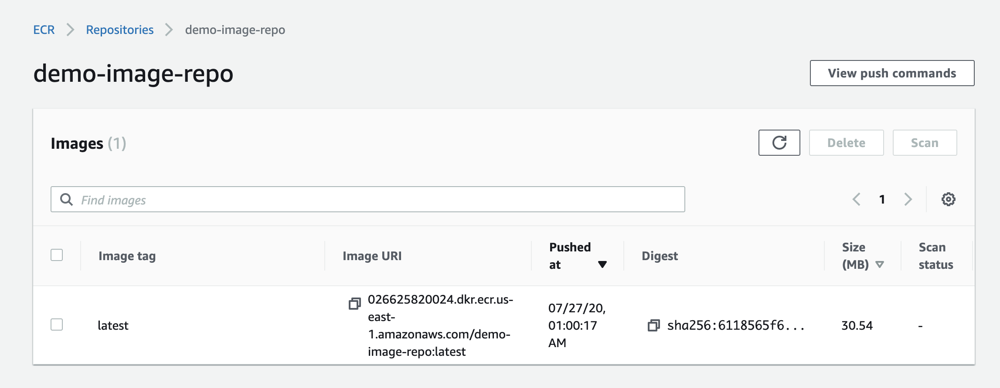

# Flask Container build to AWS ECR

Hello World, Flask container build example of AWS CodeCommit, Codebuild to ECR.

## How to get CodeCommit repo


1. Set up your aws credential

```
aws configure
```

2. Set up the credential helper

```
git config --global credential.helper '!aws codecommit credential-helper $@'
git config --global credential.UseHttpPath true
```

> If you clone repository get return 403, remove `git-codecommit.${REGION}.amazonaws.com` of `Keychain Access` on macOS.

3. Git clone of CodeCommit HTTPS URI

```
git clone https://git-codecommit.us-east-1.amazonaws.com/v1/repos/demo-source-repo
```

4. Copy sample code and modify `ECR_URI` to CodeCommit repo.

```
cp -R repo/* demo-source-repo/
```

then modify own `ECR_URI` path of buildspec.yml

```
env:
  variables:
    ECR_URI: "xxxxxx.dkr.ecr.us-east-1.amazonaws.com/demo-image-repo"
```

5. Push code

```
git add .
git commit -am "initial commit"
git push origin master
```

6. Check pipeline build succeeded

- CodePieline build succeeded


- Check ECR build image tag `latest`



